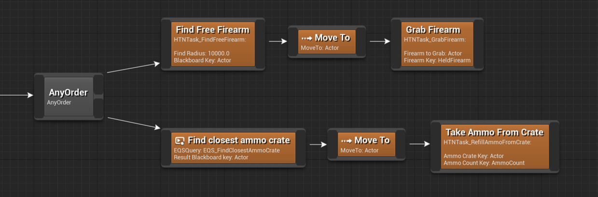

The AnyOrder node is a structural node with two outputs. 
The branches are planned and executed in sequence, but in no particular order.

In this example there two branches: one for getting a firearm, and one for getting ammo.
Because of the AnyOrder node the planner will both consider getting a firearm first, and then ammo, and the other way around. In the end the planner will choose whichever plan has the lowest cost.

?> This useful when a number of things need to be done and the order doesn't matter, but might affect the cost of the plan.
