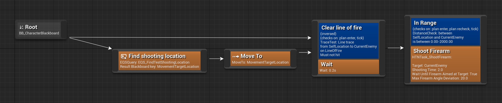

Unlike [primitive tasks](task.md), Compound (or SubNetwork) tasks represent entire sub-plans produced from a separate HTN. This allows for greater modularity and readability.

Here a subnetwork task references an HTN. During planning this node will expand to a sub-plan produced from that HTN. If a particular part of an HTN is complex, but serves a single discernible goal, it is recommended to consider extracting that part into a sub-HTN.

?> A subnetwork task might even reference the same HTN it is contained it, allowing Task Networks to be recursive. See the `HTN_SimpleTest` or `HTN_GetInShootingRange` HTNs from the example project.