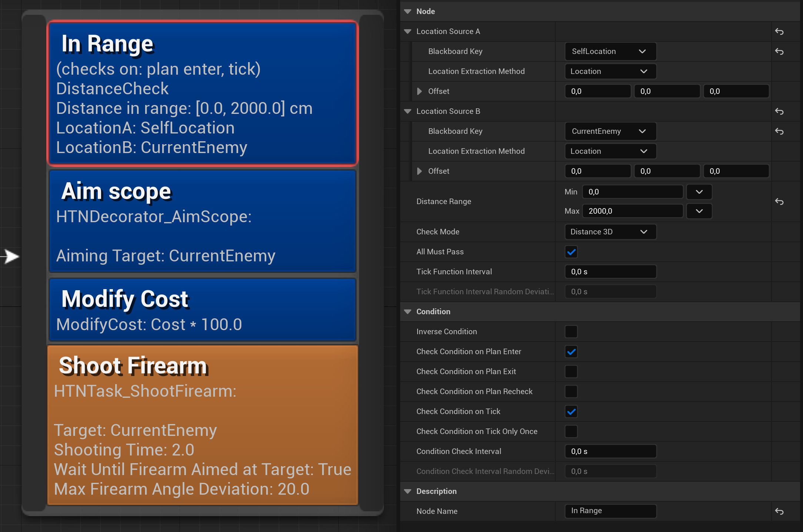

# Decorator node reference

Decorators are subnodes used to modify the plan-time and execution-time behavior of a standalone node, such as a task, a compound task, or a structural node.

Decorators can be used for the following:
- Conditions
- Planning effects
- Modify task cost during planning
- Running code during plan execution

> Custom decorators can be made by creating a subclass of `UHTNDecorator_BlueprintBase` (for Blueprints) or `UHTNDecorator` (for C++).

## Condition check time

Conditions can be configured to be checked at any of these moments:

- On plan enter – when the planner tries to add the task to a plan, before calling `CreatePlanSteps`
- On plan exit – when the planner tries to add the task to a plan, after calling `CreatePlanSteps`
- On plan recheck – when the planner rechecks a current plan for validity
- On tick – on tick while the decorator is active

## Execution scope

A decorator is active for as long as the node it's on is active. 
This means different things for different standalone nodes:

- For a primitive task – while the task is executing. 
- For a compound task – while the sub-plan of that task is executing.
- For a structural node – while any task within this HTN after this structural node is executing.
- For a root node – while any task in or under the current HTN is executing.

## Overridable functions

### PerformConditionCheck

Called when testing if the underlying node can be added to the plan or executed. The `CheckType` parameter indicates what kind of check it is: during planning, during execution etc.

### ReceiveModifyStepCost

During planning, this can be used to modify the cost of the plan step this decorator is on.
Return the new cost of the plan step (must be non-negative)

### ReceiveOnPlanEnter

This provides an opportunity to change worldstate values during planning, before entering the underlying task or subnetwork.

!> This is only called if the condition check passed.

### ReceiveOnPlanExit

This provides an opportunity to change worldstate values during planning, after exiting the underlying task or subnetwork.

!> This is only called if the condition check passed.

### ReceiveExecutionStart

Called when execution of the underlying task or subnetwork begins.

### ReceiveTick

Tick function, called for as long as the underlying task or subnetwork is executing.

### ReceiveExecutionFinish

Called when execution of the underlying task or subnetwork finishes.
