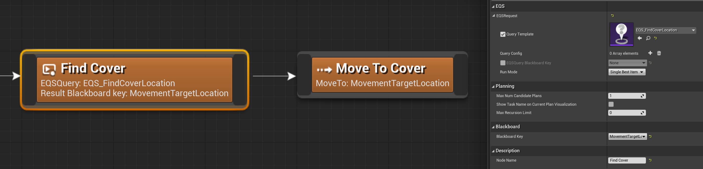

The plugin integrates with the [Environment Query System](https://docs.unrealengine.com/en-US/Engine/ArtificialIntelligence/EQS/index.html). The EQSQuery task allows the planner to run EQS queries during planning and put results into the worldstate. 

The plugin provides a mechanism for EQSContexts to get information from the current worldstate. For example, the `HTNQuerierLocation` context provides the `SelfLocation` from the currently considered worldstate. This allows running EQS queries around locations the character might be at in the future. A character might make a plan for moving to a shooting location, shooting, and then moving to cover. In this case EQS query for finding the cover location will need to be run around where the character will be after shooting.

> Custom EQS contexts with access to the current worldstate can be made from Blueprints by making a subclass of `UEnvQueryContext_HTNBlueprintBase`, which provides the `GetWorldState` and `GetQuerierLocation` helper functions.

## Returning multiple results

If an EQS query produces multiple valid results, the task returns the one with the highest score by default. 
It is possible to configure an EQSQuery task to produce multiple plan steps, one for the top N items found by the EQS query. To do this, set the `RunMode` property to `All Matching` and set the `Max Num Candidate Plans` to a value greater than zero.

This can be useful in cases where it's hard or impossible to predict the optimal decision early in the plan, so considering a wider range of possible plans is necessary.

?> It is also possible for custom tasks to produce multiple alternate plan steps. See the relevant [node reference](task?id=planning).