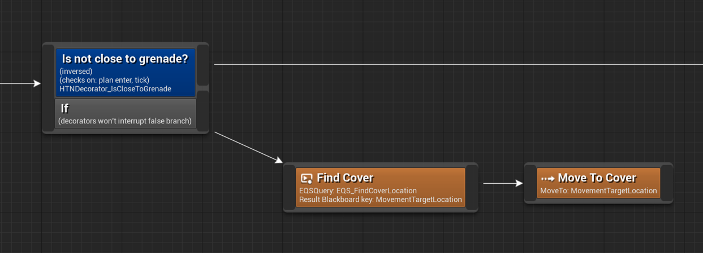

The If node is a structural node with two outputs. If all of its decorator conditions pass during planning, planning takes the top branch, the bottom branch otherwise.

It keeps checking the decorators during execution, so it can interrupt plan execution when conditions change. In this example, the character might be busy executing the true branch, but then a grenade gets close to them.
The condition becomes false, and the whole plan gets aborted, so the character comes up with a new plan to run for cover.

?> You can untick the `Can Conditions Interrupt False Branch` property to prevent the false branch from being aborted due to changing decorator conditions. 
In this example that makes the character keep running for cover even when out of grenade range.

This node creates an [execution scope](decorator?id=execution-scope) for subnodes.