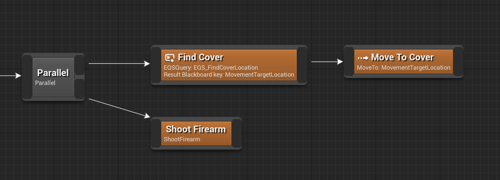

The Parallel node is a structural node with two outputs. It plans both branches independently, but they’re executed in parallel.

In this example, the character will run for cover and, while doing that, shoot a gun at whatever they’re aiming at.

!> The bottom branch is **secondary** to the top one. Once the top branch completes execution, the bottom branch is aborted.
  You can tick the `Wait For Secondary Branch To Complete` property to force plan execution to wait for both branches to complete before moving on.
  You can tick the `Loop Secondary Branch Until Primary Branch Completes` to keep executing the secondary branch over and over until the primary branch finishes execution.

This node creates an [execution scope](decorator?id=execution-scope) for subnodes.