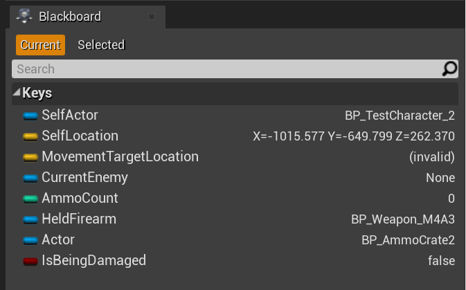

The basic building block of HTN-based AI is a **Task**. A planner arranges tasks into a plan that can be executed one by one. Primitive tasks, like `Move To` or `Grab Firearm`, are atomic actions the character can execute. Compound tasks like `Get in Shooting Range` in the image above are compound tasks that expand into a plan of their own.

Each task contributes a certain cost the plan, such that the planner strives to find the plan with the lowest total cost during planning. The cost of each task is determined during planning.

A Hirearhical Task Network is a graph of tasks from which an AIController can generate plans. Of all the possible plans that can be made from an HTN, the planner efficiently finds the plan with the least total cost. For example, the HTN in the image above can produce the following two plans:

<table>
<tr>
    <td><b>1</b></td>
    <td><code>Shoot Firearm</code></td>
</tr>
<tr>
    <td><b>2</b></td>
    <td><code>Find shooting location</code></td>
    <td><code>Move To</code></td>
    <td><code>Shoot Firearm</code></td>
</tr>
</table>

?> Just like with [Behavior Trees](https://docs.unrealengine.com/en-US/Engine/ArtificialIntelligence/BehaviorTrees/BehaviorTreesOverview/index.html), the blue subnodes on the `Shoot Firearm` task are **Decorators**. Decorators are mainly used for conditions, but may also be used to modify their task nodes in other ways. For more info, see the reference page on [decorators](decorator.md). 

In the picture above, the `Shoot Firearm` task may only be executed if there's a clean line of fire to `CurrentEnemy` and said enemy is in shooting range.

Suppose a planner begins making a plan with this HTN, and the character is out of shooting range. Because of this, the planner can't make plan **1**, but can make plan **2**, because it knows, at the time of planning, that after executing the MoveTo task the character will be in shooting range. The planner knows that the character will be in a different location and checks the conditions with that in mind.   

> The planner can consider hypothetical future states using **worldstates**

## Worldstates

A worldstate is a data structure containing various information useful during planning. 
Information like character locations, available items, whether you have a gun or ammo and so on. 
Worldstates are efficiently made from the AI's blackboard. Copies of them are modified by tasks to represent hypothetical future states, based on which conditions are checked.

Tasks have **preconditons** on worldstates. 
This means that given a worldstate, it’s possible to determine whether or not a task can be executed, usually by checking decorators. The `In Shooting Range` decorator checks the distance between the `SelfLocation` and `CurrentEnemy` values in the given worldstate.

Tasks also have **effects** on the worldstate. So if a task is added to a candidate plan, it changes the worldstate at the end of the plan. 
For example, the `Move To` task changes the `SelfLocation` value in the worldstate.

## Example task

This is the implementation of the `CreatePlanSteps` function of the `GrabFirearm` task from the demo project. It only submits a plan step if there's a firearm in a blackboard key of the current worldstate. Before submitting, it sets the value of another blackboard key in the worldstate. Therefore, the preconditon of this task is that there must be a firearm in the `FirearmToGrab` key of the worldstate, and its effect is putting that firearm into the `CurrentlyHeldFirearm` key of the given worldstate.

For more info on generating plan steps, see the reference page of [tasks](task.md).

## Example planning

The planner has a priority queue of candidate plans, such that the lowest-cost plan is at the top. Most of these candidate plans are incomplete and the planner creates plan expansions from them.

Let's consider how the planner makes a plan out of the HTN in the first image, step by step. 
It begins with a single empty plan in the queue:

<table>
    <tr><td><b>Queue</b></td></tr>
    <tr><td>Empty</td></tr>
</table>

The planner dequeues that plan and creates two expansions, one for each arrow coming out of the `Root` node in the graph. 

Adding `Shoot Firearm` failed because of one of the conditions failing, so this candidate plan is not added to the queue. 
Adding `Find shooting location` succeeded, and the task put the found shooting location to the  `MovementTargetLocation` key on its worldstate. This plan is added to the queue, which now looks like this:

<table>
    <tr><td><b>Queue</b></td></tr>
    <tr><td>Find shooting location</td></tr>
</table>

The plan on top of the queue (the only one in this case) is taken out of it, and expanded upon. 
There is only one arrow coming out the "Find shooting location" task, so only one expansion is made: by adding the `Move To` task to the end of the plan. 

`Move To` does a pathfinding check between `SelfLocation` and `MovementTargetLocation`, which succeeds. It sets `SelfLocation` to `MovementTargetLocation` and submits a plan step with a cost determined by the expected path length.

<table>
    <tr><td><b>Queue</b></td></tr>
    <tr>
        <td>Find shooting location</td>
        <td>Move To</td>
    </tr>
</table>

The planner follows the only arrow coming out of `Move To`, checks decorator conditions of the `Shoot Firearm` task, and calls `CreatePlanSteps` on the task itself. All checks pass because the worldstate given to those checks has `SelfLocation` set to a location which is in shooting range and which has a clear line of fire to the enemy. It was set by the `Move To` task in the previous step.

<table>
    <tr><td><b>Queue</b></td></tr>
    <tr>
        <td>Find shooting location</td>
        <td>Move To</td>
        <td>Shoot Firearm</td>
    </tr>
</table>

The plan taken from the queue at this point ends with the `Shoot Firearm` task, which has no arrows coming out of it in the HTN. This means that this plan complete and is returned.

The entire planning process for this HTN can be expressed by this tree-like summary:

- Root
    - Shoot Firearm [Failed in shooting range]
    - Find shooting location
        - Move To
            - Shoot Firearm

A summary like this is logged into the [visual logger](vislog.md) at the end of every planning process.

            
## Plan rechecking

Suppose a character finds a plan and begins executing it. At some point during plan execution something changes in the blackboard that wasn't accounted for during planning and might invalidate the current plan. For example, the character is moving to a location from which they can shoot the current enemy, but that enemy moved to a different location and the shooting location decided on during planning may no longer be valid.

The character needs a way to automatically determine if the current plan is still valid and if not, abort it and make a new one. This is done via plan rechecking. The HTNComponent makes a worldstate from the current blackboard and propagates it through the remaining part of the current plan, rechecking conditions of decorators and tasks and applying the effects recorded during planning.

> Tasks are rechecked with the [`ReceiveRecheckPlan`](task?id=receiverecheckplan) function.
 Decorator conditions are only rechecked if they have ["Check Condition on Plan Recheck"](decorator?id=condition-check-time) enabled.