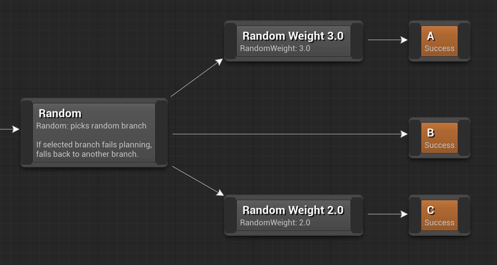

These structural nodes can be used to select between multiple branches at random during planning. Both nodes create an [execution scope](decorator?id=execution-scope) for subnodes.

### Picking branches

Branches with a higher weight have a higher chance of being picked: on the image above, the chances of each of the three branches being picked are as follows:

- A: 50% (3 times out of 6)
- B: ~16.6% (1 time out of 6). Not providing a Random Weight node assumes a weight of 1.
- C: ~33.3% (2 times out of 6)

### Fallback if failed

By default, if the Random node picked a branch and that branch failed to plan, it will randomly pick one of the remaining branches. This will repeat until a valid plan is made. If all branches fail, the branch containing the Random node fails. In this sense the Random node is like the [Prefer node](prefer.md), but the order of branches is randomly determined during every planning.

### Properties

#### Random

Property|Description
---|---
**Fall Back To Other Branches If Selected Branch Fails Planning**|If true (default), enables the fallback behavior described above. If false and the picked branch failed planning, the entire branch containing the Random node fails planning.

#### Random Weight

Property|Description
---|---
**Random Weight**|The random weight of this node. A node with weight 2x is twice as likely to be picked as a node with weight x. A node with weight 0 may only be picked if all nonzero options failed.
