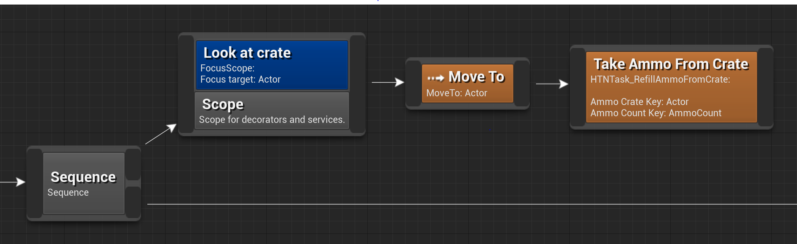

The Scope node is a structural node that defines a [scope](decorator?id=execution-scope) for subnodes.
[Decorators](decorator.md) and [services](service.md) attached to this node will be active for as long as anything after it within this HTN is active.
On the image below the character will look at the ammo crate while moving to it and taking from it.

