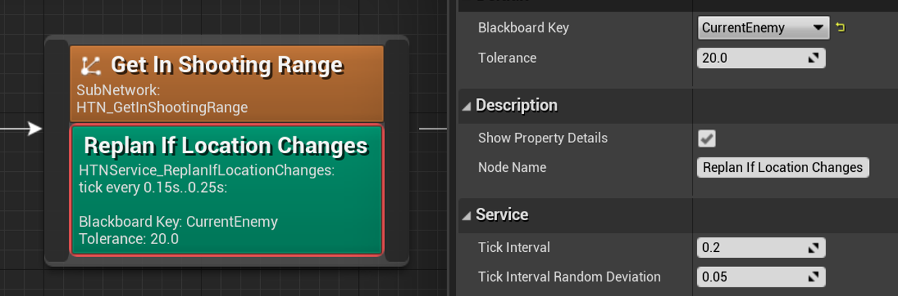

# Service node reference

Services are another kind of subnode alongside [decorators](decorator.md). 
They execute custom code at random intervals during plan execution, much like [Behavior Tree services](https://docs.unrealengine.com/en-US/Engine/ArtificialIntelligence/BehaviorTrees/BehaviorTreeNodeReference/BehaviorTreeNodeReferenceServices/index.html).
Their execution scope is the same [as with decorators](decorator?id=execution-scope).

In this example, for as long as the character is busy getting into shooting range, every 0.15 to 0.25 seconds a piece of code will be executed.
It checks if the enemy moved too much since the service became active. If it did, the service forces the character to start making a new plan by calling `ForceReplan`.

> Custom services can be made by creating a subclass of `UHTNService_BlueprintBase` (for Blueprints) or `UHTNService` (for C++).

## Persistent tick countdown

If the `Use Persistent Tick Countdown` option is enabled, the service will keep track of the countdown to the next [Tick](service?id=receivetick) in a way that persists between different plans. For example, if the service has a 5 second interval, but the plan was aborted after 3 seconds, this service will tick 2 seconds after the beginning of the next plan.

If this option is not enabled (default), the tick countdown is reset every time a new plan begins executing, causing the service to tick every time that happens.

## Overridable functions

### ReceiveExecutionStart

Called when execution of the underlying node begins execution.

### ReceiveTick

Tick function, called at an interval defined by the `TickInterval` property for as long as the underlying task or subnetwork is executing.

### ReceiveExecutionFinish

Called when execution of the underlying node finishes execution.

### ReceiveOnPlanExecutionStarted

Called when a plan containing this node begins executing.
Together with `ReceiveOnPlanExecutionFinished`, this can be used to lock resources or notify other characters/systems about what the AI indends to do in the plan before this node actually begins executing. (e.g. reserve a specific movement target to prevent others from moving to it).

?> If called from inside this function, the [worldstate manipulation functions](manipulating-worldstates.md) will work with the worldstate with which this plan step finished planning. That worldstate cannot be modified further from this function.

### ReceiveOnPlanExecutionFinished

Called when a plan containing this node finishes executing, for any reason.
This is called even if the plan was aborted before this node could execute.

?> If called from inside this function, the [worldstate manipulation functions](manipulating-worldstates.md) will work with the worldstate with which this plan step finished planning. That worldstate cannot be modified further from this function.
