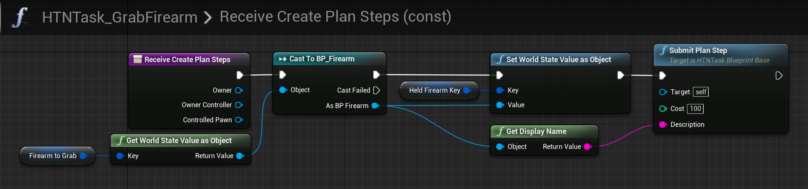

# Task node reference

The task node represents an atomic action an AIController can execute: move to point X, shoot firearm, etc. 
It encapsulates the state and behavior of this action during plan execution, as well as its preconditions and effects during planning.

> Custom tasks can be made by creating a subclass of `UHTNTask_BlueprintBase` (for Blueprints) or `UHTNTask` (for C++).

## Planning

When the planner tries adding a task to a plan, the [`ReceiveCreatePlanSteps`](#receivecreateplansteps) function is called. Here task can check preconditions on and apply effects to a worldstate to which the task is given access via [a set of functions](manipulating-worldstate.md). 

If the given worldstate fits the preconditions, the task should apply its effects and call `SubmitPlanStep`. No action is needed if the preconditions don't fit. In this example the precondition is having a valid Firearm in a specific key of the worldstate, and the effect is putting that Firearm in another key of the worldstate.

?> It is possible to submit multiple alternative plan steps by calling `SubmitPlanStep` multiple times. Each call replaces the accessed worldstate with a fresh copy without the applied effects. This allows producing multiple candidate plans from a single task, each with a step with a different set of effects.

## Execution

Task execution is exactly the same as with Behavior Tree Tasks:

The [`ReceiveExecute`](#receiveexecute) function is called when the function begins execution. 
If `FinishExecute` isn't called until then, [`ReceiveTick`](#receivetick) is called per tick until `FinishExecute` is called.

Task execution can be aborted at any time for various reasons. When that happens, [`ReceiveAbort`](#receiveabort)is called and the task continues being active (in a special "aborting" state) until `FinishAbort` is called.
If `ReceiveAbort` is not implemented, the task will be aborted immediately.

Regardless of how a task finished its execution, be it via a call to `FinishExecute` due to being aborted, [`ReceiveOnFinished`](#receiveonfinished) is called in any case when task execution ends.

?> You can use the `IsTaskExecuting` and `IsTaskAborting` helper functions to verify the status of the task during execution.

## Limiting recursion

The `MaxRecursionLimit` property of task nodes (and standalone nodes in general) allows to create recursion limits in recursive HTNs. This number limits the number of times a node may be included in a single plan. 0 means no limit.

## Overridable functions

### ReceiveCreatePlanSteps

Called during planning on the task object in the HTN asset. 
Check and/or modify information in the worldstate to produce any number of plan steps via `SubmitPlanStep`.

### ReceiveRecheckPlan

Called on a task instance inside a plan while verifying if the plan is still valid.
Check values in the worldstate and return true if the task can still be executed.
This is necessary because values in the worldstate at this point in the plan might be different due to changing conditions.

### ReceiveExecute

Entry point for execution, task will stay active until `FinishExecute` is called.

### ReceiveTick

Tick function, called as long as the task is execution.

### ReceiveAbort

If overriden, task will stay active until `FinishAbort` is called.
Otherwise the task will complete immediately when prompted to abort.

### ReceiveOnFinished

Called when the task definitively finished executing for any reason, including the AIController being destroyed.

### ReceiveDescribePlanStepToVisualLog

Called per frame on tasks that are in the future of the current plan (not executing yet but will be in the future).

Use this to log shapes to the [visual logger](vislog.md) on the "HTNCurrentPlan" category (given as parameter) to provide a visual representation of the current plan.
The worldstate in this context is the way it was submitted with SubmitPlanStep during planning.

!> This is only called if the visual logger is recording.
